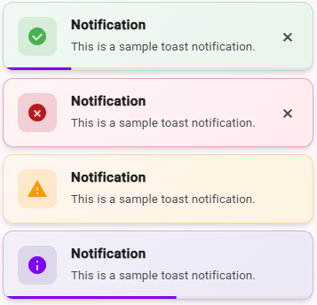

# ngx-mat-toast

[](https://www.npmjs.com/package/ngx-mat-toast)
[](https://github.com/Robin-Bley/ngx-mat-toast/actions/workflows/test.yml)
[](https://www.npmjs.com/package/ngx-mat-toast)
[](https://bundlephobia.com/package/ngx-mat-toast)
[](LICENSE)
[](https://angular.dev)

`ngx-mat-toast` is an Angular toast notification library built on top of **Angular Material `MatSnackBar`**.

It is designed for teams that want a modern, typed toast API that still feels familiar when coming from `ngx-toastr`.

> **⚠️ Upgrading from `ngx-toastr`?**
>
> `ngx-toastr` is [archived](https://github.com/scttcper/ngx-toastr) and **no longer compatible with Angular 22+**.
> `ngx-mat-toast` provides a straightforward migration path with an optional compatibility adapter that makes the transition painless.

**NPM Package:** [https://www.npmjs.com/package/ngx-mat-toast](https://www.npmjs.com/package/ngx-mat-toast)

| Light style                                                       | Full style                                                       |
| ----------------------------------------------------------------- | ---------------------------------------------------------------- |
|  |  |

## Why `ngx-mat-toast`?

- powered by Angular Material Snackbar
- standalone and NgModule integration styles
- simple service API: `success()`, `error()`, `warning()`, `info()`, `show()`, `dismiss()`, `clear()`
- global defaults plus per-toast overrides
- duplicate prevention, progress bars, close buttons, persistent toasts, and max toast limits
- optional `ToastrService` compatibility adapter for `ngx-toastr` migrations
- no Material Icons webfont dependency
- SSR-compatible (works with Angular Universal / @angular/ssr)
- demo application and Vitest-based tests included in the workspace

---

## Quick start

### 1. Install

```bash
npm install ngx-mat-toast @angular/material @angular/cdk
```

### 2. Register the provider

```ts
import { ApplicationConfig } from '@angular/core';
import { provideNgxMatToast } from 'ngx-mat-toast';

export const appConfig: ApplicationConfig = {
  providers: [
    provideNgxMatToast({
      duration: 3000,
      progressBar: true,
      position: { horizontal: 'end', vertical: 'top' },
      preventDuplicates: true,
    }),
  ],
};
```

### 3. Show a toast

```ts
import { Component, inject } from '@angular/core';
import { NgxMatToastService } from 'ngx-mat-toast';

@Component({
  selector: 'app-example',
  template: `<button type="button" (click)="save()">Save</button>`,
})
export class ExampleComponent {
  private readonly toast: NgxMatToastService = inject(NgxMatToastService);

  public save(): void {
    this.toast.success('Profile saved successfully.', 'Saved');
  }
}
```

> `ngx-mat-toast` uses native CSS motion for both the toast cards and the current Angular Material snackbar host, so no Angular animations provider is required for the library itself.

> **Using NgModules instead of standalone APIs?** `NgxMatToastModule.forRoot()` is deprecated. For new projects, always use `provideNgxMatToast()`. The full setup (including legacy NgModule support) is documented in [`docs/getting-started.md`](docs/getting-started.md).

---

## Documentation

The root README is intentionally kept short. Use the docs below for the full guidance.

| Goal                                   | Guide                                                                    |
| -------------------------------------- | ------------------------------------------------------------------------ |
| Start from scratch                     | [`docs/getting-started.md`](docs/getting-started.md)                     |
| Learn every option and default         | [`docs/configuration.md`](docs/configuration.md)                         |
| Look up the public API                 | [`docs/api-reference.md`](docs/api-reference.md)                         |
| Customize theming and overlay styling  | [`docs/customization.md`](docs/customization.md)                         |
| Copy practical implementation patterns | [`docs/examples.md`](docs/examples.md)                                   |
| Understand the internal design         | [`docs/architecture.md`](docs/architecture.md)                           |
| Migrate from `ngx-toastr`              | [`docs/migrating-from-ngx-toastr.md`](docs/migrating-from-ngx-toastr.md) |
| Understand the compatibility adapter   | [`docs/compatibility-adapter.md`](docs/compatibility-adapter.md)         |
| Troubleshoot setup or styling issues   | [`docs/troubleshooting.md`](docs/troubleshooting.md)                     |
| Browse the full documentation hub      | [`docs/README.md`](docs/README.md)                                       |

---

## Migration from `ngx-toastr`

`ngx-toastr` is **archived and incompatible with Angular 22+**. If you need to upgrade Angular or are already on Angular 22+, `ngx-mat-toast` is your best path forward.

### Smooth migration with optional compatibility adapter

You have two options:

**Option 1: Use the compatibility adapter (low-risk, fastest path)**

```ts
import { ToastrService } from 'ngx-mat-toast';

// Your existing code works with minimal changes
this.toastr.success('Profile saved successfully.', 'Saved', {
  timeOut: 3000,
  progressBar: true,
  positionClass: 'toast-top-right',
});
```

**Option 2: Move to the native API (recommended long-term)**

```ts
import { NgxMatToastService } from 'ngx-mat-toast';

this.toast.success('Profile saved successfully.', 'Saved', {
  duration: 3000,
  progressBar: true,
  position: { horizontal: 'end', vertical: 'top' },
});
```

Recommended reading:

- [`docs/migrating-from-ngx-toastr.md`](docs/migrating-from-ngx-toastr.md) – complete migration guide
- [`docs/compatibility-adapter.md`](docs/compatibility-adapter.md) – adapter details and supported options

---

## Demo

- Online demo: [StackBlitz](https://stackblitz.com/github/Robin-Bley/ngx-mat-toast?file=projects/demo/src/app/app.ts)
- Local demo app: `projects/demo`

Run it locally:

```bash
npm install
npm start
```

---

## Development

Common workspace commands:

```bash
npm run build:lib
npm run test:lib
npm run build
npm run test:ci
```

Repository structure:

```text
projects/
  demo/             Example application
  ngx-mat-toast/    Publishable Angular library

docs/               Full documentation suite
.github/workflows/  CI and release automation
```

---

## Open source housekeeping

This repository also includes:

- [`CHANGELOG.md`](CHANGELOG.md)
- [`CONTRIBUTING.md`](CONTRIBUTING.md)
- [`CODE_OF_CONDUCT.md`](CODE_OF_CONDUCT.md)
- [`SECURITY.md`](SECURITY.md)
- [`LICENSE`](LICENSE)

---

## License

Licensed under the [MIT License](LICENSE).
