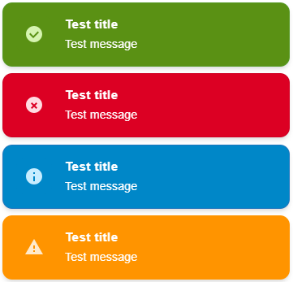

# Customization guide

This guide explains how to customize `ngx-mat-toast` safely while keeping the Angular Material snackbar host intact.

Related guides:

- [Documentation overview](./README.md)
- [Configuration guide](./configuration.md)
- [Architecture guide](./architecture.md)
- [Troubleshooting](./troubleshooting.md)

---

## Quick start: Using brand colors

Here is a ready-made example using branded colors for a professionally styled toast system:

```scss
:root {
  // Brand colors
  --brand-mid-green: #5A9114`;
  --brand-mid-orange: #FF9400`;
  --brand-red: #DC0023`;
  --brand-mid-blue: #0087C8`;

  // ngx-mat-toast with brand colors
  --ngx-mat-toast-success-color: hsl(from var(--brand-mid-green) h s calc(l + 50%));
  --ngx-mat-toast-warning-color: hsl(from var(--brand-mid-orange) h s calc(l + 40%));
  --ngx-mat-toast-error-color: hsl(from var(--brand-red) h s calc(l + 50%));
  --ngx-mat-toast-info-color: hsl(from var(--brand-mid-blue) h s calc(l + 50%));
}

.ngx-mat-toast-snack-panel {
  .ngx-mat-toast-item__title {
    font-size: 16px;
  }

  .ngx-mat-toast-item__message {
    font-size: 14px !important;
  }

  .ngx-mat-toast-item--success,
  .ngx-mat-toast-item--warning,
  .ngx-mat-toast-item--error,
  .ngx-mat-toast-item--info {
    .ngx-mat-toast-item__title,
    .ngx-mat-toast-item__message {
      color: white !important;
    }
  }

  @each $type,
    $color
      in (
        ('success', var(--brand-mid-green)),
        ('warning', var(--brand-mid-orange)),
        ('error', var(--brand-red)),
        ('info', var(--brand-mid-blue))
      )
  {
    .ngx-mat-toast-item--#{$type} {
      background: #{$color} !important;

      .ngx-mat-toast-item__icon {
        background-color: #{$color} !important;
      }
    }
  }
}
```

**Result:**



Simply copy this into your global `src/styles.scss` to get started with branded toasts.

---

## Customization principles

`ngx-mat-toast` is intentionally not a custom overlay framework.

Instead, it renders a stack of toast cards inside Angular Material `MatSnackBar`. That means the safest customization strategy is:

1. keep the Material snackbar host intact
2. style the toast stack from global styles
3. override only the visual tokens you need
4. avoid coupling styles to private Material internals beyond what is necessary for overlay targeting

---

## Where to place custom styles

Because snackbars are rendered in the CDK overlay container, component-scoped styles usually do not reach them reliably.

**Best practice:** place your toast overrides in a global stylesheet such as `src/styles.scss`.

```scss
.ngx-mat-toast-snack-panel .ngx-mat-toast-item {
  border-radius: 12px;
  box-shadow: 0 8px 24px rgba(0, 0, 0, 0.16);
}
```

Avoid relying on `::ng-deep` unless your app has a very specific reason to do so.

---

## Styling hooks exposed by the library

The toast markup uses stable class names that are safe to target.

### Container and stack

- `.ngx-mat-toast-snack-panel`
- `.ngx-mat-toast-stack`

### Toast item block and elements

- `.ngx-mat-toast-item`
- `.ngx-mat-toast-item__icon`
- `.ngx-mat-toast-item__content`
- `.ngx-mat-toast-item__title`
- `.ngx-mat-toast-item__message`
- `.ngx-mat-toast-item__close`
- `.ngx-mat-toast-item__close-icon`
- `.ngx-mat-toast-item__progress`

### Type modifier classes

- `.ngx-mat-toast-item--success`
- `.ngx-mat-toast-item--error`
- `.ngx-mat-toast-item--warning`
- `.ngx-mat-toast-item--info`

---

## Material-theme-friendly styling

The default styles already use Material design tokens where possible, including:

- `--mat-sys-surface-container-high`
- `--mat-sys-on-surface`
- `--mat-sys-on-surface-variant`
- `--mat-sys-primary`
- `--mat-sys-error`

That means your Angular Material theme can influence the toast appearance without extra work.

A good first step is to make sure your Material theme is configured globally.

```scss
@use '@angular/material' as mat;

@include mat.core();

$theme: mat.define-theme(
  (
    color: (
      theme-type: light,
      primary: mat.$blue-palette,
      tertiary: mat.$orange-palette,
    ),
  )
);

@include mat.all-component-themes($theme);

:root {
  --ngx-mat-toast-success-color: #2e7d32;
  --ngx-mat-toast-error-color: #c62828;
  --ngx-mat-toast-warning-color: #ed6c02;
  --ngx-mat-toast-info-color: #1565c0;
}
```

> The library does not require a separate runtime dependency on the Material Icons font. Icons are rendered inline.

---

## CSS variables exposed by the toast item styles

The default implementation exposes a few CSS variables that are especially useful for theme-level overrides:

| Variable                        | Purpose                           |
| ------------------------------- | --------------------------------- |
| `--ngx-mat-toast-success-color` | Accent color for success toasts   |
| `--ngx-mat-toast-error-color`   | Accent color for error toasts     |
| `--ngx-mat-toast-warning-color` | Accent color for warning toasts   |
| `--ngx-mat-toast-info-color`    | Accent color for info toasts      |
| `--ngx-mat-toast-enter-offset`  | Horizontal enter animation offset |
| `--ngx-mat-toast-leave-offset`  | Horizontal leave animation offset |

Example:

```scss
:root {
  --ngx-mat-toast-success-color: #2e7d32;
  --ngx-mat-toast-error-color: #c62828;
  --ngx-mat-toast-warning-color: #ed6c02;
  --ngx-mat-toast-info-color: #1565c0;
}
```

---

## Practical styling examples

### Example 1: softer cards with a stronger title

```scss
.ngx-mat-toast-snack-panel .ngx-mat-toast-item {
  border-radius: 16px;
  padding: 16px 18px;
}

.ngx-mat-toast-snack-panel .ngx-mat-toast-item__title {
  font-size: 15px;
  font-weight: 700;
}
```

### Example 2: compact density for dashboard-style applications

```scss
.ngx-mat-toast-snack-panel .ngx-mat-toast-item {
  min-width: 240px;
  max-width: 360px;
  gap: 10px;
  padding: 12px 14px;
}

.ngx-mat-toast-snack-panel .ngx-mat-toast-item__message {
  font-size: 13px;
  line-height: 1.4;
}
```

### Example 3: stronger differentiation by toast type

```scss
.ngx-mat-toast-snack-panel .ngx-mat-toast-item--success {
  background: color-mix(in srgb, #2e7d32 8%, white);
}

.ngx-mat-toast-snack-panel .ngx-mat-toast-item--error {
  background: color-mix(in srgb, #b3261e 10%, white);
}
```

If your browser support matrix does not allow `color-mix()`, use static colors instead.

### Example 4: high-contrast dark background for success toast

```scss
.ngx-mat-toast-snack-panel .ngx-mat-toast-item--success {
  background: #000000 !important;
  border-color: rgba(255, 255, 255, 0.3) !important;
}

.ngx-mat-toast-snack-panel .ngx-mat-toast-item--success .ngx-mat-toast-item__icon {
  color: #ffffff !important;
  background-color: rgba(255, 255, 255, 0.2) !important;
}

.ngx-mat-toast-snack-panel .ngx-mat-toast-item--success .ngx-mat-toast-item__title,
.ngx-mat-toast-snack-panel .ngx-mat-toast-item--success .ngx-mat-toast-item__message {
  color: #ffffff !important;
}
```

**Important:** When overriding `background` with a solid color, use `!important` to override the default gradient. Also ensure text and icon colors have sufficient contrast for readability.

### Example 5: customizing text sizes and typography

```scss
/* Larger, more prominent toasts */
.ngx-mat-toast-snack-panel .ngx-mat-toast-item__title {
  font-size: 16px;
  font-weight: 800;
  letter-spacing: 0.5px;
  line-height: 1.5;
}

.ngx-mat-toast-snack-panel .ngx-mat-toast-item__message {
  font-size: 14px;
  line-height: 1.6;
}
```

Or for compact, space-efficient toasts:

```scss
.ngx-mat-toast-snack-panel .ngx-mat-toast-item__title {
  font-size: 13px;
  font-weight: 600;
}

.ngx-mat-toast-snack-panel .ngx-mat-toast-item__message {
  font-size: 12px;
  line-height: 1.4;
}
```

The default sizes are:

- `.ngx-mat-toast-item__title`: 15px, weight 700
- `.ngx-mat-toast-item__message`: 13px, weight 400

---

## Responsive customization

The snackbar surface already constrains width to `min(100vw - 16px, 420px)`, but you can still tune the toast card layout.

```scss
@media (max-width: 599px) {
  .ngx-mat-toast-snack-panel .ngx-mat-toast-item {
    min-width: 0;
    width: 100%;
    border-radius: 14px;
  }

  .ngx-mat-toast-snack-panel .ngx-mat-toast-item__title,
  .ngx-mat-toast-snack-panel .ngx-mat-toast-item__message {
    word-break: break-word;
  }
}
```

---

## Customization best practices by concern

### Visual consistency

- Align toast colors with your Material theme.
- Keep all toast variants part of the same design family.
- Use the title for short context and the message for the actual event.

### Readability

- Prefer high-contrast text and moderate line lengths.
- Avoid oversized shadows or intense transparency that reduce readability.
- Do not shrink the toast below a usable width for longer translated strings.

### Motion

- Keep motion subtle.
- Avoid redefining enter and leave animations unless the design system requires it.
- If your app already has many moving elements, consider disabling the progress bar by default.

### Accessibility

- Do not rely on color alone to communicate meaning.
- Keep close buttons visible for persistent or critical messages.
- Avoid auto-dismiss durations that are too short for assistive technology users.

---

## What not to customize

Avoid customizations that fight the architecture of the library:

- Do not replace the snackbar host with a separate overlay system.
- Do not assume multiple independent host outlets are active at the same time.
- Do not target generated or unstable internal Material selectors unless unavoidable.
- Do not build styles around the assumption that top and bottom stacks render in the same order.

---

## Suggested customization workflow

1. Start with the default theme.
2. Add only the global overrides you truly need.
3. Test on mobile and desktop widths.
4. Verify each toast type: success, error, warning, info.
5. Check persistent toasts with close buttons and progress-bar toasts separately.
6. Revisit [`troubleshooting.md`](./troubleshooting.md) if an override does not apply.

---

## See also

- [Configuration guide](./configuration.md)
- [Examples](./examples.md)
- [Architecture guide](./architecture.md)
- [Troubleshooting](./troubleshooting.md)
